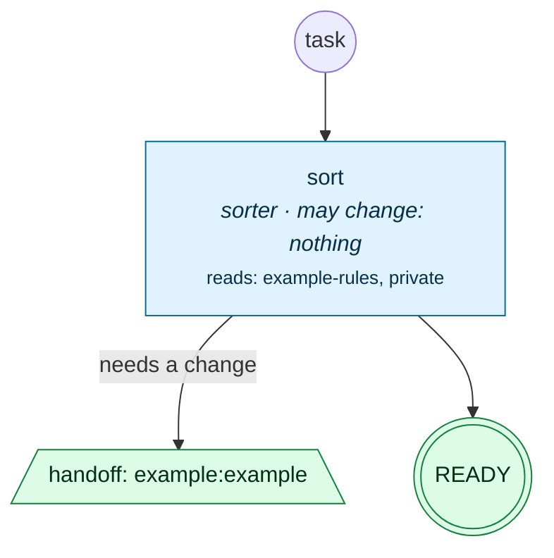

# Workflow diagrams

Generated by `scripts/graph.py --update-readme`; don't edit by hand.

## triage
<!-- graph:triage:start -->

```mermaid
flowchart TD
  START(("task")) --> sort
  sort["sort<br/><i>sorter · may change: nothing</i><br/><small>reads: example-rules, private</small>"]
  change[/"handoff: example:example"\]
  ready((("READY")))
  sort -->|"needs a change"| change
  sort --> ready
  classDef human fill:#fef3c7,stroke:#b45309,color:#451a03
  classDef role fill:#e0f2fe,stroke:#0369a1,color:#082f49
  classDef esc fill:#fee2e2,stroke:#b91c1c,color:#450a0a
  classDef done fill:#dcfce7,stroke:#15803d,color:#052e16
  class sort role
  class change done
  class ready done
```
<!-- graph:triage:end -->
