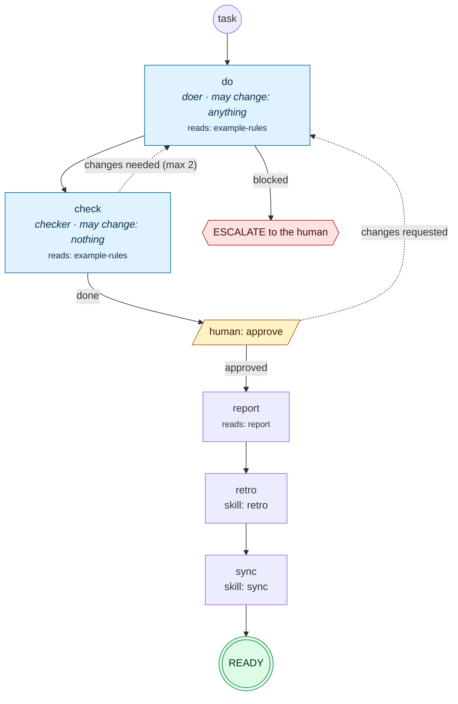

# Workflow diagrams

Generated by `scripts/graph.py --update-readme`; don't edit by hand.

## example
<!-- graph:example:start -->

```mermaid
flowchart TD
  START(("task")) --> do
  do["do<br/><i>doer · may change: anything</i><br/><small>reads: example-rules</small>"]
  check["check<br/><i>checker · may change: nothing</i><br/><small>reads: example-rules</small>"]
  approve[/"human: approve"/]
  report["report<br/><small>reads: report</small>"]
  retro["retro<br/>skill: retro"]
  sync["sync<br/>skill: sync"]
  escalate{{"ESCALATE to the human"}}
  ready((("READY")))
  do -->|"blocked"| escalate
  do --> check
  check -.->|"changes needed (max 2)"| do
  check -->|"done"| approve
  approve -.->|"changes requested"| do
  approve -->|"approved"| report
  report --> retro
  retro --> sync
  sync --> ready
  classDef human fill:#fef3c7,stroke:#b45309,color:#451a03
  classDef role fill:#e0f2fe,stroke:#0369a1,color:#082f49
  classDef esc fill:#fee2e2,stroke:#b91c1c,color:#450a0a
  classDef done fill:#dcfce7,stroke:#15803d,color:#052e16
  class do role
  class check role
  class approve human
  class escalate esc
  class ready done
```
<!-- graph:example:end -->
